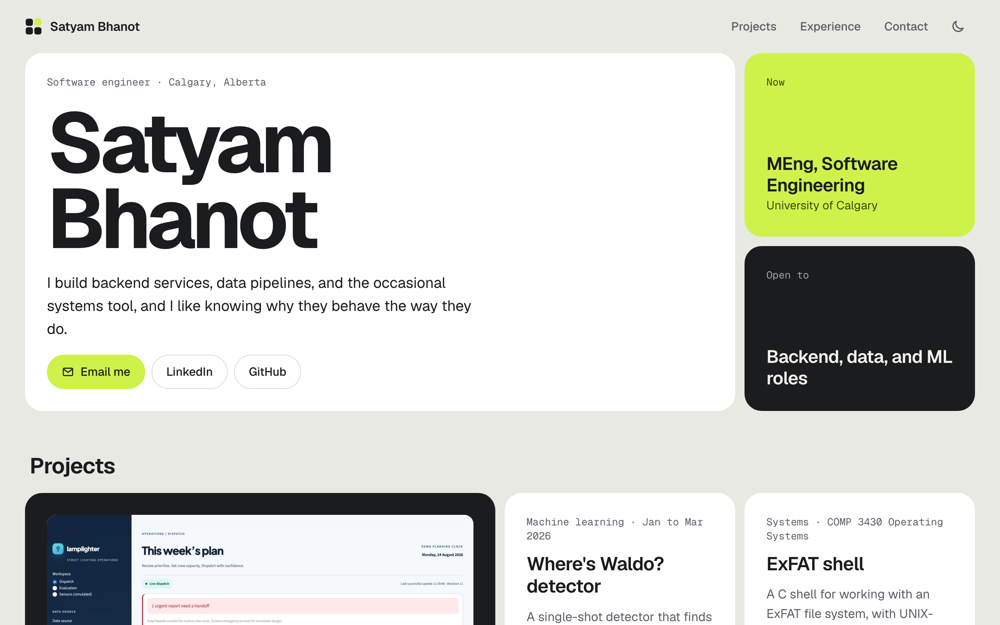

# satyambhanot.com

My personal site: who I am, what I've built, and how to reach me.

**[satyambhanot.com →](https://satyambhanot.com)**

<picture>
  <source media="(prefers-color-scheme: dark)" srcset=".github/screenshot-dark.png">
  
</picture>

## What's on it

- **Intro**: what I do, what I'm working on now, and one-click email, LinkedIn, and GitHub links
- **Projects**: every project as a tile, with full case studies for
  [Lamplighter](https://satyambhanot.com/projects/lamplighter/) and
  [Where's Waldo?](https://satyambhanot.com/projects/wheres-waldo/)
- **Experience and education**: roles, degrees, and the tools I use
- **Contact**: email with a copy button, plus links

It works on phones, in light and dark mode, and without JavaScript.

## Built with

| | |
| --- | --- |
| Framework | [Astro](https://astro.build) 7, static output |
| Styling | Plain CSS with design tokens; [Geist](https://vercel.com/font) and Geist Mono |
| Content | A TypeScript data file and Markdown, validated at build time |
| Images | Astro's image pipeline: responsive WebP |
| Hosting | GitHub Pages, deployed by GitHub Actions |

There's no UI framework. The only client-side JavaScript is the theme toggle and the copy-email
button.

## Run it locally

You need Node 22.12 or newer.

```bash
npm install
npm run dev      # http://localhost:4321, reloads as you edit
npm run build    # static site in dist/
```

## How it's organized

```text
src/
├── site.ts               profile, education, experience, tools
├── projects/             one Markdown file per project
├── images/               project screenshots and figures
├── pages/
│   ├── index.astro       the home page
│   ├── projects/[slug].astro   case-study pages
│   └── 404.astro
├── components/           Layout (header + footer), ProjectTile, Icon
├── styles.css            colours, spacing, and all styles
└── content.config.ts     the fields a project file can have
public/                   favicon, social preview image, CNAME
```

## Updating content

Almost every change is in one of two places. Nothing in the layout needs to change.

**Profile, education, or experience.** Edit `src/site.ts`. Lists go newest first, and leaving
out an `end` date marks something as current.

**A new project.** Add `src/projects/<name>.md`:

```markdown
---
title: My project
summary: One sentence on what it does.
order: 3                  # position on the home page; 1 gets the big tile
type: Backend             # short category shown on the tile
stack: [Python, FastAPI]
period: Nov 2026          # optional
context: Course or event  # optional
team: Solo                # optional
role: What I built        # optional
takeaway: One line on what it taught me.          # optional, shown on the tile
repo: https://github.com/satyambhanot/my-project  # optional
---

Optional write-up. If there's text here, the project gets its own page.
```

A project with only the header block stays a tile on the home page. Add a write-up below it and
the project gets its own case-study page, and its tile links there.
[`lamplighter.md`](src/projects/lamplighter.md) shows a full example with a cover image and
figures. If a field is missing or a link isn't a valid URL, the build stops and names the file.

**Résumé.** Add `public/resume.pdf` and set `resume: '/resume.pdf'` in `src/site.ts`. Résumé
buttons then appear in the header, the intro, and the contact section.

## Deploying

Every push to `main` builds the site and publishes it to GitHub Pages
([workflow](.github/workflows/deploy.yml)). The custom domain comes from `public/CNAME`.

## Design notes

The site is built for someone with a minute to spare, usually a recruiter. It should answer three
questions fast: who is this, what have they built, and how do I reach them.

- **One main page.** It reads top to bottom: intro, projects, experience, contact. The header
  stays pinned, so any section is one click away.
- **Contact in the first screen.** Email, LinkedIn, and GitHub sit next to my name. The "Now"
  and "Open to" tiles answer the availability question right away.
- **Depth only where it exists.** Case-study pages are only for projects with a real write-up,
  and each has a back button. Smaller projects say everything on their tile.
- **Honest links.** Code links appear only where a public repo exists.
- **Accessible.** Every text colour passes WCAG AA in both themes. The site is fully
  keyboard-navigable and respects reduced-motion settings.

## License

[MIT](LICENSE)
