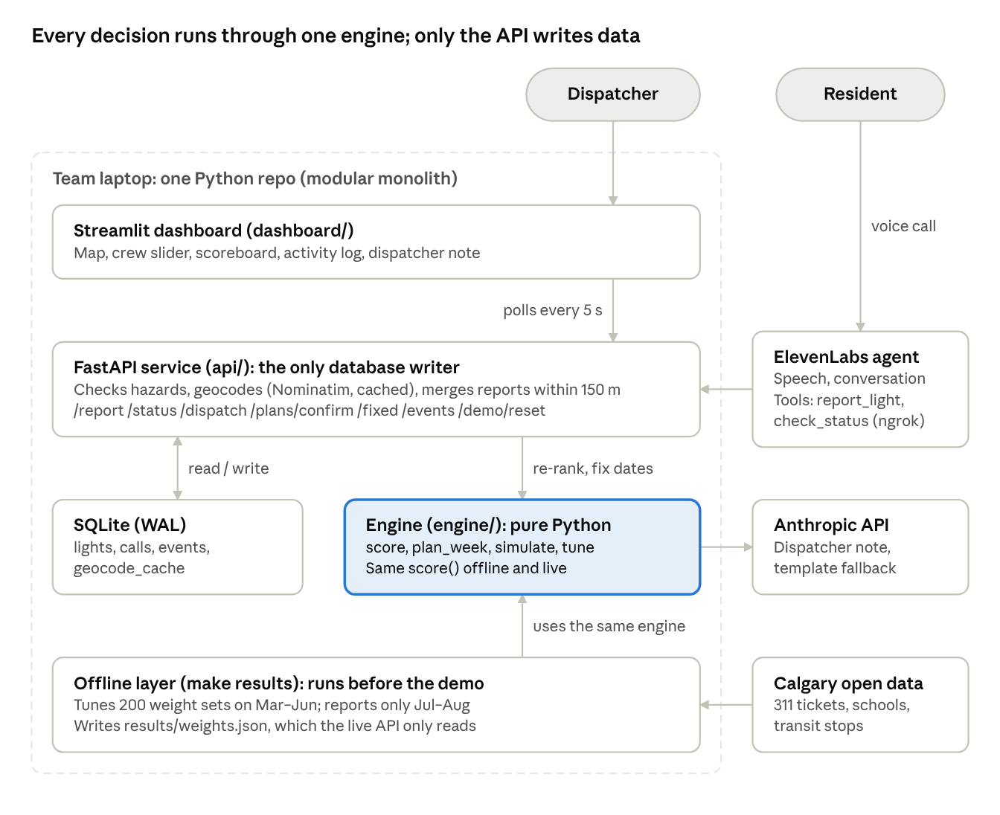

## The problem

Calgary residents report broken street lights through 311. A repair crew only has so many hours a week, so someone has to decide which lights get fixed first. The default is oldest-first. The hackathon case asked whether a better policy could cut the number of nights a street stays dark, especially near schools and transit.

## What we built

- **A decision engine in plain Python.** It loads 774 real street-light tickets (March 23 to August 27, 2026) and scores each light. The score uses its age, damage reports, repeat calls, nearby schools and transit stops, and how many dark lights are around it. It then plans a weekly route that fits a 14 crew-hour budget.
- **A FastAPI and SQLite service.** It's the only thing that writes to the database. It merges duplicate reports within 150 m, keeps hazards like downed poles out of the routine queue, and re-ranks the queue live when a new report comes in.
- **A Streamlit dispatch dashboard.** A dispatcher reviews the proposed route on a map, adjusts crew capacity, confirms the plan, and marks repairs.
- **A voice line.** Residents can call in a report through an ElevenLabs voice agent, and it appears in live dispatch within seconds.

## My part

I set up the repo and built the decision engine one phase at a time. That meant loading the 311 data, the replay simulation and oldest-first baseline, the scoring policy, weight tuning, the dispatcher note, and then the FastAPI and SQLite API. I also built the dispatch dashboard's route review and map. My teammates built the voice agent and the simulated pole sensors, and wrote most of the design document.

## Decisions that mattered

1. **One scoring function, offline and live.** The replay that produces our results and the API that ranks live reports call the same `score()`. The numbers on the evaluation screen describe the same logic the dispatcher actually uses.
2. **Tune on one window, report on another.** A random search over 200 weight sets ran on March to June. Results come only from the unseen July and August weeks.
3. **The tuner can't move the goalposts.** The cost of a dark night (higher near schools, transit, and damage) is fixed in config and never tuned. Only the policy weights change.

## Results

On the July to August test weeks, at the full crew budget:

| Policy | Risk-weighted dark nights | vs oldest-first | Lights fixed | Median days dark |
| --- | --- | --- | --- | --- |
| Oldest first | 4,018.5 | | 167 | 18.0 |
| Hand-set weights | 3,357.2 | −16.5% | 167 | 18.0 |
| Tuned weights | 3,006.0 | −25.2% | 166 | 16.5 |

The crew fixes about the same number of lights either way. The gain comes from fixing the right ones first. The tuned policy also had the fewest risk-weighted dark nights at 70% and 85% of the crew budget.

## Limits

Repairs in the demo are simulated, and the clock is frozen at a demo date. Travel time assumes straight lines and weekly planning, so fix-date estimates are approximate. The repo's code review lists the remaining modelling limits.
